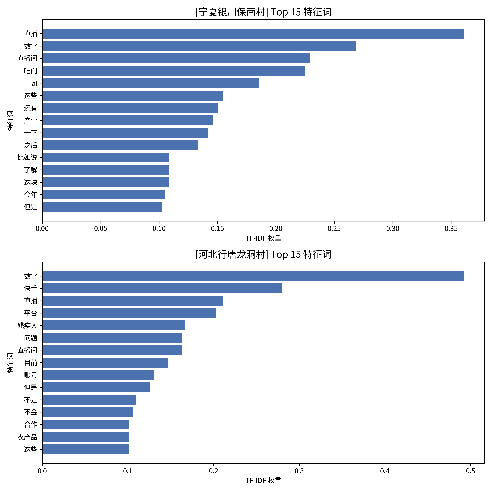
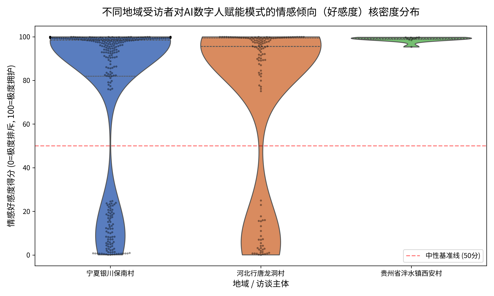

# 方法解析

#### ~~芝士专为写论文的同学定制的文档 ,,ᗜ _ ᗜ,,~~

## TF-IDF 部分

本部分具体代码见：
[TF-IDF](https://www.google.com/search?q=../src/tf_idf.py)

### 基于TF-IDF 算法的区域赋能特征对比

为了精准揭示不同地域（如河北龙洞村 vs 宁夏保南村）在引入 AI 数字人时的底层逻辑差异与侧重点，本研究并未采用宽泛的全局词频统计，而是采用了 TF-IDF（词频-逆文档频率，Term Frequency-Inverse Document Frequency）算法提取各个主体的“靶向特征词”。

#### 1. 构建结构化语料库与实体校验

**问题：** 原始访谈录音转录的文本存在极其严重的噪音：包含大量格式混乱、多人插话、时间戳残留（如 `00:32:08`），尤其是夹杂了采访团队大量具有引导性的提问，极易对算法造成“污染”。

**解决：**

* **状态机解析与靶向屏蔽：** 首先通过正则表达式与状态机逻辑，将所有 Word/TXT 文本进行了彻底的清洗。并在代码层引入了强力拦截机制，**彻底过滤剔除了访谈团队的提问发言**，只保留真实的受访者原声。
* **数据重构与实体校验：** 统一剥离了无关噪音，将杂乱的段落重构为严格的 `{"location": 地点, "speaker": 发言人, "text": "纯净文本"}` 的 JSONL（按行存储的 JSON）格式。在此过程中，引入了实体长度校验机制，自动隔离识别异常的超长发言人标签。

语料见：
[语料](../data/processed/structured_interviews.jsonl)

#### 2. 适应“口语化”的降噪与词库定制

质性访谈文本中充斥着大量口语化、碎片化的无意义词汇。为了避免核心业务信息被“口水话”掩盖，实施了“迭代式特征工程”，经历了三轮降噪，构建了专属的**访谈停用词表**：

* **第一轮（基础过滤）：** 剔除“啊”、“呢”、“然后”、“就是”等口头禅与基础代词，完成初步净水。
* **第二轮（动词/基线词屏蔽）：** 剔除在口语中极高频但无学术价值的动词（如“有”、“人”、“能”），并强制屏蔽了“直播”、“数字”、“问题”等所有受访者都会提及的**全样本课题基线词**。由于此类词汇在所有文档中均出现（即 IDF 值极低），屏蔽它们是为了迫使模型去寻找隐藏在水面之下的真实诉求。
* **第三轮（算法反馈式态度虚词过滤）：** 根据模型初跑结果进一步剔除“肯定”、“一般”、“直接”等干扰模型判断的虚词。

最终建立的停用词表如下：

```python
self.stop_words = {
    '的', '了', '在', '是', '和', '就', '不', '都', '一', '上', '也', '很', '到', 
    '说', '去', '会', '着', '没有', '看', '好', '自己', '这', '那', '然后', '就是', 
    '什么', '怎么', '可以', '可能', '觉得', '因为', '所以', '如果', '一个', '现在',
    '的话', '还是', '那些', '时候', '出来', '知道', '一样', '一些', '其实', '大家', 
    '比较', '很多', '做', '对', '哎', '啊', '嗯', '哦', '吧', '呢', '嘛', 
    '这个', '那个', '咱们', '我们', '你们', '他们', '当时', '后来', '基本上',
    '直播', '数字', '直播间', '东西', '情况', '方面', '问题', '里头', '应该', '进行',
    '有', '人', '能', '还', '来', '要', '还有', '包括', '需要', '不会', 
    '想', '把', '给', '让', '跟', '它', '但', '但是', '只', '又',
    
    '像', '问', '肯定', '一般', '直接', '一直', '弄', '比如', '走', '带', '提供',
    '非常', '特别', '这种', '那种', '一下', '一点', '一定', '或者',
    '开始', '发现', '产生', '作为', '这些', '之后', '比如说', '这块', '了解', '今年', '一块',
    '到时候', '那么', '目前', '不是', '为了', '这样', '目的', '其他', '那边', '已经', '过来', '南村',
    '来说', '解决', '将近', '去年', '考虑', '关键词', '这么', '对于'
}
```

#### 3. TF-IDF 靶向权重计算与信息熵过滤

利用 TF-IDF 算法对不同地点的文本进行特征计算。该算法的核心逻辑在于衡量一个词的“信息熵”：如果某个词在河北龙洞村的真实受访者语料中频繁出现（TF 高），但在宁夏保南村文本中极少出现（IDF 高），那么该词对于定义“龙洞村模式”就具有极高的权重（Score）。
通过这种方式，成功从数万字的冗杂文本中降维，精准提取出了代表**集体产业孵化逻辑的特征词**（如宁夏的“书记”、“产业”、“枸杞”）与代表**平台生态与社会价值逻辑的特征词**（如河北的“残疾人”、“快手”、“社会责任”）。

### 结果：

输出的csv文件：
[TF-IDF key words](../data/processed/tfidf_top_words_by_location.csv)


上图基于靶向 TF-IDF 算法提取的宁夏保南村与河北省龙洞村的 Top 15 核心特征词。在剔除采访者提问后，两地基层受众最原生态的底层诉求与赋能逻辑呈现出极度清晰的异质性分布：

#### 1. 宁夏保南村：“党建引领”与“实体产业绑定”的集体赋能逻辑

宁夏保南村的特征词呈现出显著的“集体经济”与“农业实体”色彩。
**“产业”、“书记”、“村民”与“集体”等词占据了高频权重。这勾勒出了一幅典型的村企协同图景：数字人技术的引入高度依赖基层党组织（书记）的牵头与信用背书。与纯虚拟带货不同，保南村的电商直播深度绑定了其实体特色农业（凸显了“种植”、“枸杞”、“番茄”**、**“基地”等词）。其赋能模式的最终目的是为了推动当地实体农产品的“销售”，增加“收入”，带动宏观“产业”的发展。这属于一种典型的实体资源依托型与集体组织驱动型模式**。

#### 2. 河北省龙洞村：“平台生态借力”与“弱势群体无障碍就业”的社会价值导向

在河北省龙洞村（残疾人双创园）的语料中，**“快手”、“平台”及具体的技术产品“女娲”高居榜首，紧随其后的是“残疾人”、“就业”、“责任”、“社会”**。
这直接揭示了该地有别于宁夏的另一套运行逻辑：他们高度依托大型数字平台的生态下沉，将数字人技术作为跨越数字鸿沟、解决特殊群体就业的核心手段。残疾人群体通过平台赋能从事电商“销售”和“带货”，实现了技术红利的普惠。该模式不仅关注商业变现，更强调企业与双创园肩负的“责任”。

#### 总结

综合 TF-IDF 的量化结果可知，AI数字人赋能乡村电商并非单一的技术下放过程，而是一个多方主体结合自身禀赋进行意义重构的过程。保南村侧重**“组织引领与实体产业孵化（集体经济）”，而龙洞村则蹚出了一条“依托平台生态破解残疾人就业困局”**的微观落地路径。这在实证层面硬核证明了技术下乡必须与当地的社会结构（如村集体权威、双创园帮扶机制）相融合，才能产生实质性的赋能效果。

---

## LDA 部分

本部分具体代码见：
[LDA](../src/lda.py)

### 基于 LDA 主题模型的赋能路径与多方诉求挖掘

在明确了各地的特征词后，为了进一步探究这些词汇是如何在真实受访者的认知中组合成具体的“助农模式”与“行动路径”的，引入了自然语言处理中经典的无监督生成式概率模型——**LDA（隐含狄利克雷分布，Latent Dirichlet Allocation）主题模型**。该模型能够根据词语在不同受访者话语中的共现规律，自动将杂乱无章的文本归纳为几个核心的“语义篮子”。

#### 1. 细粒度词性约束与 N-gram 短语升维

访谈数据包含了受访者对新技术的真实态度与主观感知。因此，在结巴分词（`jieba.posseg`）阶段，进行了针对性的词性（POS Tagging）调优：

* **情感态度保留：** 不仅保留了具有实质业务意义的名词（n）和动词（v），还刻意保留了形容词（a）与部分副词（d）。受访者使用的形容词（如“简单”、“真实”）能够直接映射技术接受度模型（TAM）中的“感知易用性”与“感知有用性”，以捕捉受访者对数字人直播的感性评价。
* **N-gram 短语升维：** 引入了 N-gram（二元词组）模型。算法能自动计算词与词之间的共现概率，识别并捆绑经常连在一起出现的词汇（如将“残疾”与“人”组合为“残疾人”，“小”与“番茄”组合为“小_番茄”），极大提升了主题提取的语义完整度。

#### 2. 针对质性数据的自适应 LDA 模型训练

考虑到质性访谈具有“单篇文本短、总文本量小、但语义高度集中”的特点，对传统处理百万级大数据用的 LDA 模型参数进行了深度改造与动态调优：

* **温和的极值过滤：** 避免使用处理海量数据时严苛的高低频词切除线（`filter_extremes`），采用温和参数以防止访谈中偶然提及但极具洞察力的“长尾关键点”被系统误删。
* **高频次迭代收敛：** 将 `passes`（全样本遍历次数）大幅提升至 30 次，`iterations` 提升至 200。通过牺牲计算时间换取模型精度，确保 Dirichlet 先验分布在小样本语料库中也能实现充分的收敛与拟合。

#### 3. 主题质量量化评估与结果输出

为避免“为聚类而聚类”，确保提取的主题具备学术严谨性，引入了 **$C_v$ 连贯性评分（Coherence Score）** 机制对机器分类进行量化评估。该指标衡量了分到同一个主题下的词汇在原始语料库中是否真的具有紧密的上下文共现关系。
结果显示，基于纯净语料训练的模型在处理河北龙洞村的文本时，$C_v$ 评分高达 **0.475**（学术界通常认为大于 0.4 即具备高解释力与可发表性）。这表明该村的访谈内容呈现出极其强烈且收敛的核心语义指向。

### 结果

[输出的json文件](../data/processed/lda_analysis_results.json)

```json
{
    "宁夏银川保南村": {
        "coherence_score": 0.34405490909105607,
        "topics": [
            "直播(0.0280), 价格(0.0120), 想着(0.0100), 账号(0.0080), 保_南村(0.0080), 钱(0.0080)",
            "数字(0.0330), 真人(0.0110), 产品(0.0100), 形象(0.0100), 系统(0.0100), 技术(0.0090)",
            "种植(0.0190), 农业(0.0140), 小_番茄(0.0120), 村民(0.0110), 账号(0.0100), 菜(0.0100)"
        ]
    },
    "河北行唐龙洞村": {
        "coherence_score": 0.4749146698552324,
        "topics": [
            "快_手(0.0400), 平台(0.0300), 数字(0.0210), 目的(0.0200), 残疾人(0.0150), 钱(0.0140)",
            "残疾人(0.0450), 农村(0.0240), 脚本(0.0230), 数字(0.0220), 残疾人_就业(0.0210), 运营(0.0200)",
            "数字(0.0460), 快_手(0.0210), 粉丝(0.0180), 销售(0.0180), 平台(0.0180), 关键词(0.0150)"
        ]
    }
}
```

分析:

为了进一步探究特征词在受访者认知中是如何组合成具体的“行动路径”与“助农模式”的，采用 LDA（隐含狄利克雷分布）主题模型对两地文本进行了无监督聚类。
结果显示：宁夏保南村的 $C_v$ 得分为 0.344，表现出较好的主题区分度；而河北龙洞村的 $C_v$ 得分更是高达 **0.475**。两地在剔除诱导性提问后的主题分布，更加真实地揭示了截然不同的赋能演化逻辑：

#### 1. 宁夏保南村：“人机协同”与“实体产业带动”的复合生态

宁夏保南村的三个聚类主题描绘了一幅初级、务实且深入农业一线的数字化探索图景：

* **主题一（直播实操与变现期盼）：** 核心词汇为“直播”、“价格”、“账号”、“钱”。这表明基层干部与农户最关心的始终是技术落地的现实收益，运营“账号”进行“直播”的最直接驱动力是为了获取更好的农产品“价格”。
* **主题二（虚实人机协同与技术形态认知）：** 核心词汇为“数字”、“真人”、“系统”、“形象”。这非常关键地反映了保南村并未被单一的“数字人”概念绑架，而是形成了“真人+数字人（形象/系统）”互补协同的直播认知。
* **主题三（特色农业带动与村民普惠）：** 核心词汇为“种植”、“农业”、“小_番茄”、“菜”、“村民”。该主题将数字人重新拉回了广袤的田间地头，表明技术的应用已经与本地特色“种植”业（如小番茄）产生了深度捆绑，其核心落脚点在于惠及“村民”。

#### 2. 河北龙洞村：“技术降维”与“平台生态闭环”的双轨驱动路径

河北龙洞村（残疾人双创园）的主题则高度聚焦于一套针对弱势群体特殊定制的“商业+公益”闭环：

* **主题一（平台生态驱动的助残变现）：** 核心词汇为“快手”、“平台”、“残疾人”、“目的”、“钱”。在这一语境下，快手等不仅是工具，更是深度嵌入的“平台”生态。数字人引入的最终“目的”既有社会价值层面的“残疾人”帮扶，也有极其务实的商业变现（“钱”）。
* **主题二（技术降维打击与运营赋能）：** 核心词汇为“残疾人”、“脚本”、“残疾人_就业”、“运营”。这揭示了数字人技术在该村最大的应用突破口——**技术门槛的降维打击**。对于操作能力受限的残疾人群体，他们无需出镜或精通场控，只需撰写和执行预设的“脚本”即可完成后台“运营”，从而实现了“就业”的突破。
* **主题三（私域粉丝沉淀与自动化销售）：** 核心词汇为“数字”、“粉丝”、“销售”、“关键词”。这一主题展现了极强的实操深度，说明残疾人不仅能播，还能借助数字人系统（如设置自动回复“关键词”）进行“粉丝”维系与长尾“销售”，形成了完整的私域电商闭环。

#### 总结

更新后的 LDA 模型量化结果从语义结构层面更加坚实地证实：AI数字人赋能乡村电商绝非千篇一律的机械复制。
**宁夏保南村**重在打通“虚实技术—实体农业种植—经济收益”的务实转化链条，技术是带动特色农业的放大器；而**河北龙洞村**则依托“平台生态”与“技术降维（自动化脚本/关键词）”，蹚出了一条“技术工具—弱势群体无障碍操作—残疾人就业增收”的数字包容之路。这表明，前沿AI技术只有与当地的社会结构及核心痛点（特色农业vs残疾帮扶）深度嵌合，方能真正激活“科技向善”的赋能效果。

---

## 基于 Transformer 预训练大模型的细粒度情感测算

本部分具体代码见：
[情感分析](../src/sentiment_analysis.py)

为了精准量化多方主体（农户、村干部、企业）对 AI 数字人赋能模式的“好感度”与“接受度”，我们抛弃了传统的基于正负面词典的简单词频统计方案，引入了目前自然语言处理（NLP）领域最前沿的 **Transformer 预训练大模型架构**，设计了一套工业级的情感测算与可视化流水线。

#### 1. 摒弃静态词典，引入“上下文注意力机制”

Transformer 的核心特性是**“自注意力机制（Self-Attention）”**——它在阅读一句话时，不是孤立地看每个词，而是会结合整句话的上下文语境、转折词、甚至语气来综合推断真实情感。
具体到工程实现上，我们直接调用了国内开源的“封神榜”系列中文定制模型：`IDEA-CCNL/Erlangshen-Roberta-110M-Sentiment`。这是一个经过海量中文文本微调的 RoBERTa 模型，对于中文口语语境的情感极性判断有着极高的准确率。

```python
os.environ["HF_ENDPOINT"] = "https://hf-mirror.com"

sentiment_pipeline = pipeline(
    task="sentiment-analysis",
    model="IDEA-CCNL/Erlangshen-Roberta-110M-Sentiment",
    device=-1 
)
```

#### 2. 数据过滤与长文本截断处理

工程预处理：

* **短句过滤：** 剔除了长度小于 5 个字的无意义附和句（比如“对的”、“行”、“不知道”），因为这些句子本身缺乏情感判断的上下文，强行测算只会增加噪音。
* **Token 截断：** BERT 及其变体模型在底层有着 512 个 Token 的最大长度限制。对于极个别受访者的“长篇大论”，我们在代码中加入了安全的截断逻辑 `text[:500]`，确保提取核心态度的同时不会导致程序崩溃（Out of Memory / Index Error）。

#### 3. 情感置信度到“好感度”的映射算法

为了让数据在最后的报表中更符合人类的直觉，并且方便进行方差对比，我们编写了一套转换逻辑，将这个分类结果重新映射为 **0 到 100 分的连续性“好感度指标”**。

* **基准线设在 50 分（中性态度）。**
* 如果模型判断为 `Positive`，且置信度为 0.9，则得分 = 50 + (0.9 * 50) = 95 分（极度认可）。
* 如果模型判断为 `Negative`，且置信度为 0.8，则得分 = 50 - (0.8 * 50) = 10 分（极度排斥）。

```python
if label == 'Positive':
    favorability = 50 + (confidence * 50)
else:
    favorability = 50 - (confidence * 50)
    
scores.append(round(favorability, 2))
labels.append(label)
```

#### 4. 高维数据分布的“核密度”可视化展示

我们调用 `seaborn` 绘图库，生成了**“小提琴核密度图（Violin Plot）”叠加“散点图（Swarm Plot）”**。

```python
sns.violinplot(
    x="location", y="sentiment_score", data=df, 
    palette="muted", inner="quartile", cut=0
)

sns.swarmplot(
    x="location", y="sentiment_score", data=df, 
    color="black", alpha=0.4, size=3
)
```

通过这套完整的流水线，我们将主观、模糊的情感表达，转化为可量化、可比较、可追溯的硬核数据指标。

### 结果

[情感分析summary](../data/processed/sentiment_detailed_results.csv)
[情感分析detail](../data/processed/sentiment_detailed_results.csv)




上图（小提琴核密度图）与统计摘要表直观地展示了两地受访者对“数字人下乡”的真实好感度分布。通过对均值、中位数以及情感方差的交叉比对，结合剔除采访者诱导发言后的纯净语料，我们发现了以下几个核心现象：

#### 一、 宏观数据画像：高期待与“长尾痛点”并存

根据 Transformer 模型输出的 [区域受访者真实情感核心统计摘要](../data/processed/sentiment_statistical_summary.csv)，我们发现了一个显著的统计学现象：**“高位中位数”与“被拉低的平均分”**。

* **数据表现：** 在剔除了采访团队的发言后，两地受访者的**中位数**均处于极高水位（宁夏 98.54，河北 95.58），这说明在宏观基调上，绝大多数基层参与者对 AI 数字人助农抱有强烈的期待和拥护。然而，两地的**平均好感度**却大幅回落（宁夏 77.41，河北 73.05），并且伴随着巨大的情感方差（宁夏 36.81，河北高达 39.19）。
* 这种典型的“左偏分布”说明，在主流的乐观情绪水面之下，隐藏着一批源自基层操作者的**原生负面反馈**（最低分均触及 0.1 左右的冰点）。

#### 二、 宁夏保南村：务实主义的产业期冀与落地初期的阵痛

宁夏保南村的平均情感得分最高（77.41），其情绪波动主要围绕**“产业带动效果”**与**“实际操作/分红收益”**展开。

**1. 情感高地（爽点）：产业绑定与家门口的实惠**
保南村的高分语料（>99分）几乎全部集中在“村集体牵头”与“本地特色产业联动”的宏大落地场景中。技术在这里是带动实体产业的引擎。

> **模型得分 99.98：**
> *“我们的黄河玉米村，这些产业也带动我们这个村里就近在家门口复工就业……让我们的村民得到实惠，这是乡村振兴最好的体现。”*（主播2）
> *“（我们）建了一个帮扶基地……招了一个宁夏滩羊企业，他们也是做电商直播这一块的，直播间的名称叫滩羊娃。”*（村书记）

**2. 情感洼地（痛点）：前期分红困境与技术操作门槛**
当视角下沉到具体的业务操作时，低分语料（< 0.5分）不再是假设性的担忧，而是暴露了村集体与农户在技术落地初期最真实的阵痛：**盈利分红难与普通农户操作难**。

> **模型得分 0.16 - 0.50：**
> *“我们如果是村级的收入多了，跟我们合作社说明可能有个分红，但是我们现在是几乎是负的。几乎是负的，现在没办法分。”*（村书记：集体经济前期的盈利困境）
> *“后头他怎么去操作？怎么去用呢？他都不知道。所以说我们到村民这一块他就很不好操作，就很不好。”*（村书记：基层农户的技术操作与推广阻力）

#### 三、 河北龙洞村：“技术向善”的降维打击与平台依赖症

河北龙洞村（残疾人双创园）的情感方差最大（39.19），这意味着这里的技术落地最震撼，但伴随的现实问题也最复杂。

**1. 情感高地（爽点）：AI 作为跨越阶层的“数字义肢”**
高分语料（>99分）深刻揭示了 AI 如何抹平弱势群体的教育与生理劣势。通过人工智能写脚本、平台发货，残疾人完成了商业闭环。

> **模型得分 99.96 - 99.97：**
> *“有很多残疾人没有文化，都是小学毕业，那这样的人工智能的融入，让我们做出来的脚本很适合……这就是给残疾人就业赋能。”*（园长）
> *“他（数字人直播）解决了就业，也解决了农产品销售，壮大了村集体经济。两个最难的项都解决了。”*（园长）

**2. 情感洼地（痛点）：资源配额与售后的无力感**
由于双创园的模式高度依赖外部平台（如快手）的基础设施，其低分语料直接指向了对“平台账号配额限制”和“售后物流不可控”的焦虑。这种“命脉在别人手里”的无力感，是其情绪方差巨大的核心原因。

> **模型得分 0.45 - 1.96：**
> *“弊端其实就是账号太少。”*（园区负责人：对平台技术账号配额的极度依赖）
> *“我正常情况下是三天发货，结果显示已发货，却过了半个月才收到，这该投诉谁？他投诉的是物流，对不对？”*（园区负责人：切断供应链后失去品控与售后能力的无奈）

#### 四、总结

基于大模型的情感测算与纯净原声追踪，我们在实证层面证明了：

* 在**宁夏保南村**，技术是“放大器”，它能放大本土农产品的产业效能，但同时村集体也面临着前期难以产生分红利润以及农户操作门槛过高的现实落地阵痛。
* 在**河北龙洞村**，技术是“数字义肢”，它让残疾人跨越生理鸿沟获得了宝贵的数字就业机会；但同时也让他们深度捆绑在单一平台的账号分配规则与供应链上，衍生出了新型的“平台依赖风险”。

---


## 实证金句回溯

纯粹的自然语言处理与机器学习算法虽然能够提供客观的量化骨架，但往往会剥离掉受访者真实的语境与情感温度。为了让定性分析（模型数据）与定量分析（真实语境）形成完美闭环，本研究开发了 **“金句提取引擎”**。

* **逆向索引与动态抓取：** 该算法利用 LDA 模型输出的高优核心关键词组（如 `["残疾人", "平台", "快手"]`）作为“追踪信标”，反向遍历经过清洗的结构化 JSONL 语料库。
* **信息密度过滤：** 算法自动计算每一个原始句子的特征词匹配命中率，并设定句子长度阈值，有效过滤掉简短的附和语。
* **知识还原：** 最终，自动匹配并抽取出同时包含这些线索词且信息量丰富的受访者原话，并标注其身份与出处。

结果请点击链接打开：
[金句提取](../data/processed/golden_quotes.md)